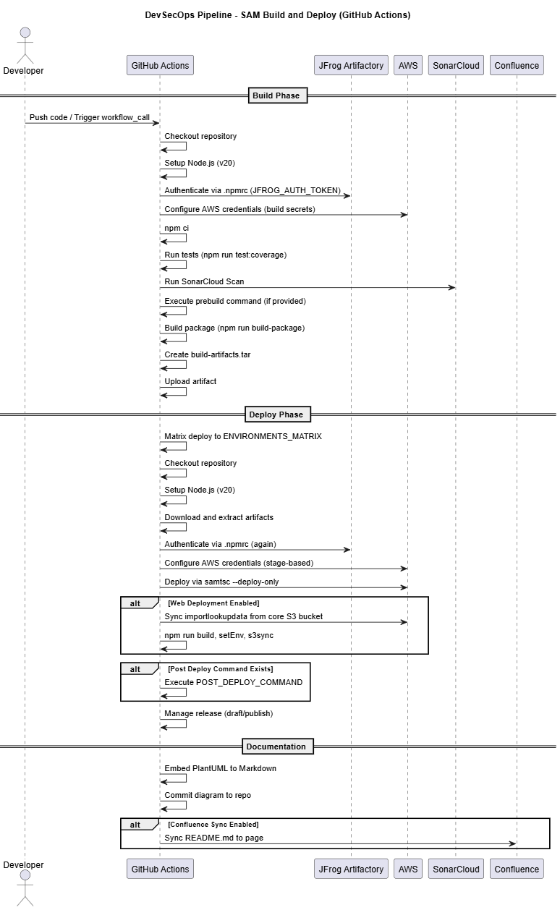

## Description:
Repository for Mutual of Enumclaw resuable Workflows.
This contains resusable workflows to be used within other GitHub actions workflows in the .github\workflows folder.
This repository must be public in order to use the resusable workflows in other repositories.

## Example Usage of nucleus-build-and-deploy-sam-stack.yaml:
```
name: Build and Deploy

on:
  workflow_dispatch:
  push:
    branches:
      - develop

jobs:
  build-and-deploy:
    uses: mutual-of-enumclaw/nucleus-deployment-pipeline/.github/workflows/nucleus-build-and-deploy-sam-stack.yml@main
    with:
      node-build-version: '20'
    secrets: inherit
```

## DEVSECOPS



### 1. **Development**
- **Source Code Management**: Developer pushes code or opens PRs in GitHub, triggering the workflow.
- **Dependencies**: Artifacts retrieved securely from JFrog Artifactory via authenticated `.npmrc`.
- **Build/Test**: Node version set, dependencies installed (`npm ci`), and unit tests run with coverage.

### 2. **Security**
- **Secret Management**: All sensitive information (AWS keys, JFrog/Sonar tokens) are managed through GitHub Secrets.
- **Principle of Least Privilege**: Each job sets specific permissions (e.g., `contents: read` for build, `contents: write` for deploy).
- **Static Analysis**: SonarCloud scans for code quality and vulnerabilities (SAST).
- **Artifact Handling**: Artifacts are archived, uploaded, and retained for a limited period (30 days).

### 3. **Operations**
- **Build Artifact Handling**: Archive and upload of build directory for portability between jobs.
- **Deployment**:  
  - AWS credentials configured for each environment (matrix strategy).
  - SAM deployments are run for each stage.
  - Website is built and deployed to S3 if parameters are set.
- **Release Management**: Uses custom GitHub Action to manage releases (draft, publish, etc.).
- **Post-Deployment Automation**: Custom post-deploy commands can be executed for additional operational steps.

### 4. **Documentation/Compliance**
- **Diagram Management**: PlantUML diagrams are automatically embedded in Markdown.
- **Documentation Sync**: README.md is synced with Confluence for traceability and compliance, using credentials managed via GitHub Secrets.

---

## Security Considerations

- **Credentials**: All credentials are sourced from secrets and not hardcoded.
- **Auditability**: Each step is logged, and artifact uploads/downloads are tracked.
- **Code Quality and Security Scanning**: Integrated via SonarCloud.

---
